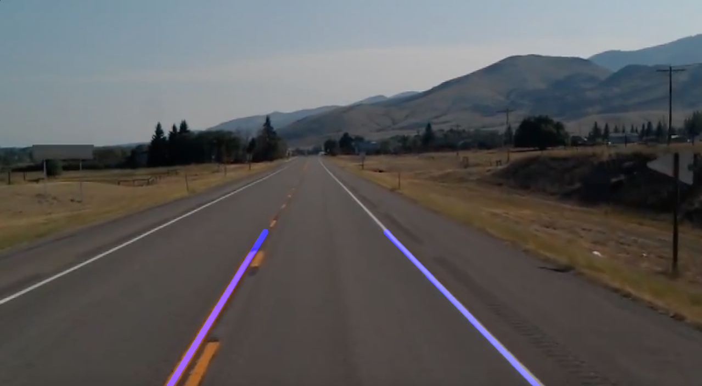

# Car App

## Lane Detection

### Single Frame Lane Detection

I utilized the hough transform method from the cv2 library to detect common intersection points in different bins with a couple of different image manipulations to draw strong detected edges as they appeared in a single frame. 

The initial image:

The result:

### Continuous Lane Detection with stream

You can extend a lot of what you do with single frame lane detection to a continous set of frames if you process each frame at some discrete millisecond interval. 
There are a fair amount of tutorials online that followed the Hough Transform method using the CV library that helped implement the hough transform method for each of those frames.

Overlayed result:

There are a couple of problems with the above approach that doesn't allow us to use this in most road conditions:
1. Since the above algorithm only looks for linear graphs and patterns within the road, it fails to properly account for curved lanes
2. Straight lines can exist within subspaces of any given frame which makes it hard to know what necessarily counts as a lane (i.e. traffic signs)
3. The mask parameters can't adapt for drastic changing environments without manually changing the dimensions 
4. Visibility of the area isn't always clear, i.e. different amounts of saturation or brightness in any given scene. 

There's research that utilizes spatial CNNs (which capture rows and columns as separate layers to better represent spatial information) and other image segmentation techniques that perform better.

